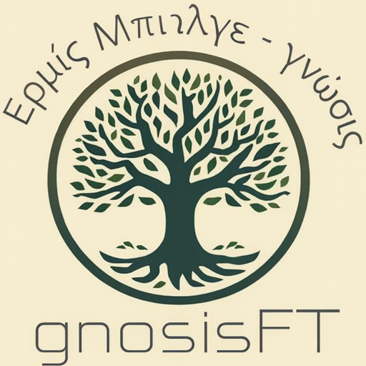

  <a href="https://gnosisft.com" target="_blank">
    
    &nbsp;&nbsp;&nbsp; <!-- Gap between images -->
    
  </a>

# 🧠 GnosisFT (SmartBuy-AI)

**GnosisFT is a live AI recommendation engine that turns natural-language shopping requests into structured constraints, ranked results, and concise explanations.**

Instead of sifting through endless filters, users just describe what they need — e.g.,  
> “I need a laptop for heavy 3D rendering under $2500”  

The system translates intent into hard constraints, searches the product database, ranks candidates, and summarizes *why* they fit.

🌐 **Live Demo:** [gnosisft.com](https://gnosisft.com)

---

## 🛠 Engineering Philosophy

Most AI shopping assistants are thin wrappers over an LLM, which often leads to hallucinated recommendations or generic advice.  

GnosisFT was designed to answer a simple but critical question:  
**How can we make LLMs respect hard constraints while keeping recommendations human-readable and trustworthy?**

The system separates responsibilities:

- **Deterministic backend:** handles constraint enforcement, ranking, and database querying  
- **LLM layer:** generates concise natural-language summaries and explanations  
- **Intent classification logic:** interprets free-form user requests and routes them appropriately  

This ensures users get correct, usable recommendations, even if the LLM layer is temporarily unavailable.

---

## ✨ Core Capabilities

### Natural-Language Constraint Parsing
Users express requirements freely, and the system extracts:

- Budget limits
- Task or product intent (laptop, TV, book, etc.)
- Hardware or feature priorities
- Implicit preferences

---

### Hybrid Recommendation Pipeline
1. **Intent-aware request handling** (via LangChain agents)  
2. **Constraint extraction & rule-based filtering**  
3. **Candidate retrieval from product database**  
4. **Deterministic ranking based on weighted attributes**  
5. **LLM-generated explanation** for the top items  

This modular design keeps reasoning **transparent, interpretable, and controllable**.

---

### Conversation Memory
- Multi-turn chats stored in Supabase  
- Previous messages influence future recommendations  
- Allows refined suggestions without restating constraints

---

### Multi-Category Ready
While currently live for **laptops**, the architecture is designed to scale to:

- Smartphones  
- TVs  
- Books  
- Other product categories  

LangChain agents will handle routing between categories, enabling a **future multi-domain AI shopping assistant**.

---

## 🏗 High-Level Architecture

### Frontend
- React (SPA) with chat-style UI  
- Stateless client, all intelligence resides server-side  

### Backend & AI
- FastAPI (Python)  
- Modular AI pipeline orchestrated via **LangChain agents**:
  - Intent parsing  
  - Constraint extraction  
  - Retrieval & ranking  
  - Summarization / explanation  

- LLM-Agnostic Layer: Currently supports **Gemini-3-Flash**, **Gemini-2.5-Flash**, and **GPT-4o-mini**

### Data & Auth
- Supabase (PostgreSQL)  
- Conversation and user history storage  
- Authentication and secure access  

---

## 🚀 Example Flow

1. User enters a natural-language request  
2. LangChain agent interprets intent and category  
3. Backend extracts constraints  
4. Products retrieved and ranked  
5. LLM generates a **short, natural explanation**  
6. Conversation state persisted for future refinement  

---

## ⚡ Deployment

- **Frontend:** Static hosting (always-on)  
- **Backend:** FastAPI on Render (free tier)  
- **Database & Auth:** Supabase  

> Backend may cold-start on free tier hosting; this is an intentional trade-off for a public MVP.

---

## 🔮 Roadmap

- Multi-category support (laptops, TVs, books)  
- Improved ranking evaluation metrics  
- Real-time pricing ingestion pipelines  
- Enhanced LangChain agent orchestration  
- Comparison mode: side-by-side product analysis  

---

## 👤 Author

**Faruk Tamyurek**  
M.S. Electrical Engineering  
Focus: AI/ML systems, LLMs
